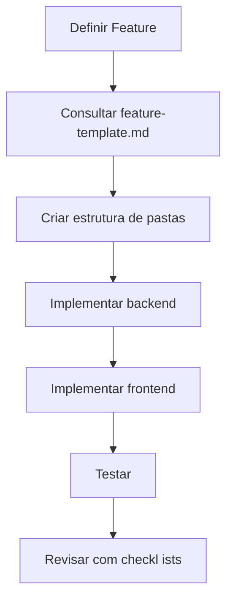
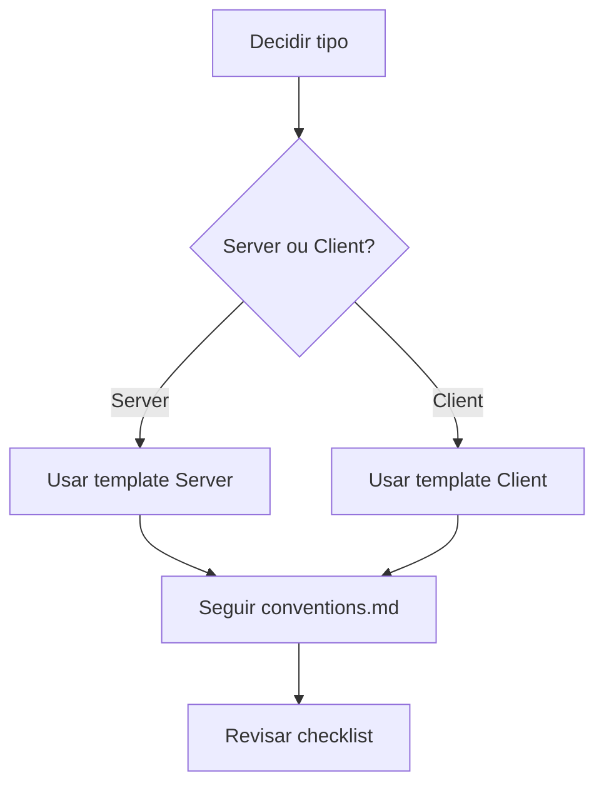

# 🤖 AI Documentation - EasyDrive

> Documentação otimizada para IAs construírem o sistema seguindo a arquitetura definida

---

## 📚 Índice de Documentação

### 1. Visão Geral

- [`00-project-overview.md`](00-project-overview.md) - Visão geral do projeto
- [`01-architecture.md`](01-architecture.md) - Arquitetura completa do sistema

### 2. Convenções e Padrões

- [`02-conventions.md`](02-conventions.md) - Convenções de código e nomenclatura
- [`03-file-structure.md`](03-file-structure.md) - Estrutura de arquivos e pastas

### 3. Frontend

- [`frontend/01-components.md`](frontend/01-components.md) - Como criar componentes
- [`frontend/02-queries-mutations.md`](frontend/02-queries-mutations.md) - React Query
- [`frontend/03-forms.md`](frontend/03-forms.md) - Formulários com RHF + Zod
- [`frontend/04-server-client.md`](frontend/04-server-client.md) - Server vs Client Components

### 4. Backend

- [`backend/01-api-routes.md`](backend/01-api-routes.md) - Como criar API routes
- [`backend/02-dtos.md`](backend/02-dtos.md) - Data Transfer Objects
- [`backend/03-services.md`](backend/03-services.md) - Services e lógica de negócio
- [`backend/04-auth.md`](backend/04-auth.md) - Autenticação e autorização

### 5. Features

- [`features/feature-template.md`](features/feature-template.md) - Template para criar features
- [`features/examples/`](features/examples/) - Exemplos de features completas

### 6. Templates

- [`templates/component.tsx`](templates/component.tsx) - Template de componente
- [`templates/page.tsx`](templates/page.tsx) - Template de página
- [`templates/api-route.ts`](templates/api-route.ts) - Template de API route
- [`templates/service.ts`](templates/service.ts) - Template de service
- [`templates/dto.ts`](templates/dto.ts) - Template de DTO

### 7. Checklists

- [`checklists/new-feature.md`](checklists/new-feature.md) - Checklist para nova feature
- [`checklists/new-component.md`](checklists/new-component.md) - Checklist para novo componente
- [`checklists/new-api.md`](checklists/new-api.md) - Checklist para nova API

---

## 🎯 Como Usar Esta Documentação

### Para IAs (LLMs):

1. **Leia primeiro**:

   - [`00-project-overview.md`](00-project-overview.md) - Contexto do projeto
   - [`01-architecture.md`](01-architecture.md) - Arquitetura completa

2. **Para criar algo novo**, consulte:

   - Templates relevantes em [`templates/`](templates/)
   - Convenções em [`02-conventions.md`](02-conventions.md)
   - Checklist correspondente em [`checklists/`](checklists/)

3. **Para entender um conceito**:

   - Frontend: Documentos em [`frontend/`](frontend/)
   - Backend: Documentos em [`backend/`](backend/)

4. **Para criar uma feature completa**:
   - Siga [`features/feature-template.md`](features/feature-template.md)
   - Veja exemplos em [`features/examples/`](features/examples/)

### Para Humanos:

Esta documentação serve como:

- **Guia de arquitetura** para o projeto
- **Referência rápida** de padrões e convenções
- **Templates** para acelerar desenvolvimento
- **Fonte de verdade** para decisões de arquitetura

---

## 📝 Formato da Documentação

Cada documento segue esta estrutura:

```markdown
# Título

> Descrição curta e objetiva

## 📋 O que é

[Explicação do conceito]

## 🎯 Quando usar

[Casos de uso]

## ⚡ Como implementar

[Instruções passo a passo]

## 💡 Exemplos

[Código completo e funcional]

## ✅ Checklist

[Lista de verificação]

## ⚠️ Avisos importantes

[Gotchas e cuidados]
```

---

## 🔄 Fluxo de Trabalho Recomendado

### Para adicionar nova funcionalidade:



### Para criar componente:



---

## 🎨 Princípios da Documentação

1. **Clareza**: Instruções diretas e sem ambiguidade
2. **Exemplos**: Sempre incluir código completo
3. **Consistência**: Mesma estrutura em todos os docs
4. **Completude**: Código funcional, não pseudocódigo
5. **Contexto**: Explicar o porquê, não apenas o como

---

## 🚀 Quick Start para IAs

**Prompt sugerido para AIs:**

```
Estou trabalhando no projeto EasyDrive. Li a documentação em ai/00-project-overview.md
e ai/01-architecture.md.

Quero criar [FEATURE/COMPONENT/API].

Por favor:
1. Use os templates em ai/templates/
2. Siga as convenções em ai/02-conventions.md
3. Verifique com o checklist apropriado

Gere o código completo seguindo esses padrões.
```

---

## 📊 Status da Documentação

- ✅ Visão Geral
- ✅ Arquitetura
- ✅ Convenções
- ✅ Templates
- ✅ Frontend Guides
- ✅ Backend Guides
- ✅ Feature Template
- ✅ Checklists

**Última atualização**: 2026-01-03

---

## 🤝 Contribuindo

Ao adicionar nova documentação:

1. Siga o formato padrão
2. Inclua exemplos completos
3. Adicione ao índice acima
4. Mantenha consistência de nomenclatura
5. Use markdown válido

---

## 📞 Suporte

Para dúvidas sobre a arquitetura:

- Consulte [`plans/`](../plans/) na raiz do projeto
- Veja documentação original em [`plans/arquitetura-final.md`](../plans/arquitetura-final.md)
